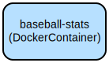

# MLB Fantasy Baseball Analytics Dashboard - Real-time Player Stats and Fantasy League Integration

This Streamlit application combines MLB player statistics with Fantrax fantasy baseball league data to provide comprehensive player analysis and acquisition insights. It helps fantasy baseball managers make data-driven decisions by offering statistical comparisons, free agent tracking, and interactive visualizations.

The dashboard provides real-time access to current season MLB statistics and integrates with Fantrax fantasy leagues to track available free agents. It features advanced statistical analysis tools including quadrant analysis for player comparisons across multiple metrics like contact quality, plate discipline, and power production. The application processes and visualizes complex baseball statistics through an intuitive interface, making sophisticated player analysis accessible to fantasy baseball managers of all experience levels.

## Repository Structure
```
.
├── docker-compose.yml     # Docker Compose configuration for containerized deployment
├── Dockerfile            # Container build instructions for the application
├── InSeasonStats.py     # Main application file containing the Streamlit dashboard logic
└── requirements.txt     # Python package dependencies for the application
```

## Usage Instructions
### Prerequisites
- Docker and Docker Compose installed on your system
- A Fantrax fantasy baseball league account
- Your Fantrax league ID

### Installation
1. Clone the repository:
```bash
git clone <repository-url>
cd <repository-directory>
```

2. Create a `League_Info.env` file with your Fantrax league ID:
```bash
echo "FANTRAX_LEAGUE_ID=your_league_id_here" > League_Info.env
```

3. Build and start the application:
```bash
docker-compose up -d
```

### Quick Start
1. Access the dashboard at `http://localhost:8501` in your web browser
2. The application will automatically load current MLB statistics
3. Navigate through the available features:
   - View current season statistical leaders
   - Compare two players using various statistical combinations
   - Track available free agents in your Fantrax league

### More Detailed Examples
#### Player Comparison Analysis
```python
# Select two players to compare
player1 = "Player Name 1"
player2 = "Player Name 2"

# Choose a statistical combination:
# - Contact Quality vs Pull Tendency
# - Plate Discipline
# - Power Production
# - Expected Production
```

#### Free Agent Analysis
```python
# View available free agents with their current statistics
# Filter by:
- Position
- Statistical categories
- Recent performance
```

### Troubleshooting
#### Common Issues
1. Connection to Fantrax API fails
   - Error: "Unable to fetch free agent data"
   - Solution: Verify your FANTRAX_LEAGUE_ID is correct in League_Info.env
   - Check your internet connection

2. Dashboard not loading
   - Error: "Could not connect to Streamlit server"
   - Solution: Ensure Docker container is running:
     ```bash
     docker ps
     docker-compose logs baseball-stats
     ```

3. Data refresh issues
   - The application automatically refreshes at 4:00 AM daily
   - Manual refresh: Restart the container
     ```bash
     docker-compose restart baseball-stats
     ```

## Data Flow
The application processes MLB statistics and fantasy baseball data through a multi-stage pipeline that combines real-time MLB data with Fantrax fantasy league information.

```ascii
[MLB Stats (pybaseball)] -----> [Data Processing] -----> [Statistical Analysis]
         |                           ^                           |
         |                           |                           v
[Fantrax API] ------------------> [Integration] -----> [Streamlit Dashboard]
```

Key Component Interactions:
1. MLB statistics are fetched using the pybaseball library
2. Fantrax API provides fantasy league data and free agent information
3. Data processing standardizes player names and statistical formats
4. Statistical analysis generates comparative metrics and visualizations
5. Streamlit dashboard presents interactive visualizations and analysis tools
6. Automatic daily refresh ensures data currency
7. Docker container manages application lifecycle and dependencies

## Infrastructure


### Docker Resources
- Container: baseball-stats
  - Purpose: Runs the Streamlit application
  - Port: 8501:8501
  - Restart: Always
  - Environment: Configured via League_Info.env
  - Schedule: Daily restart at 4:00 AM

